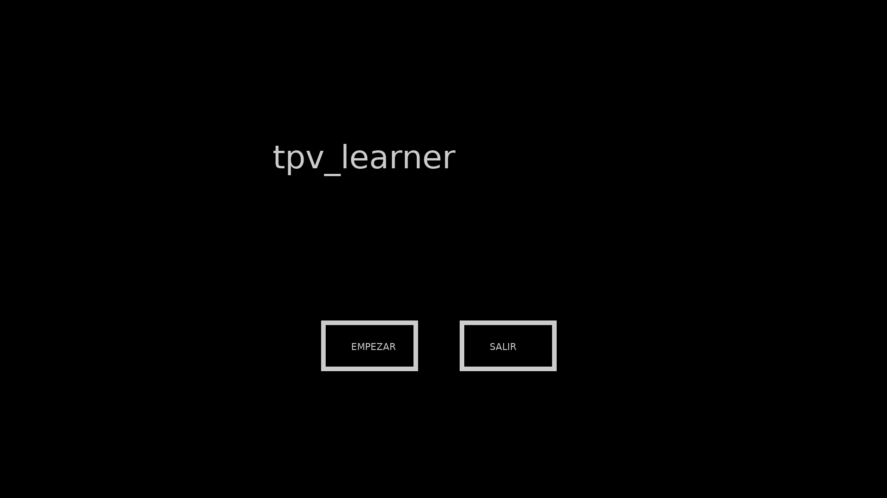
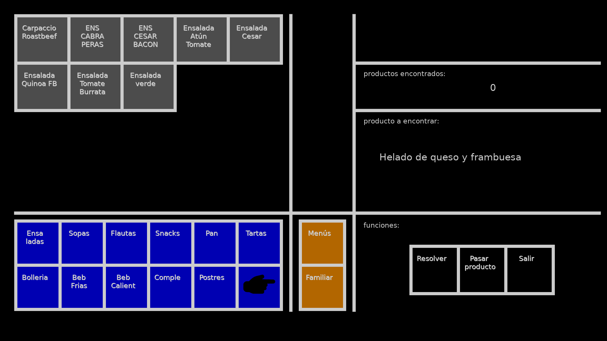
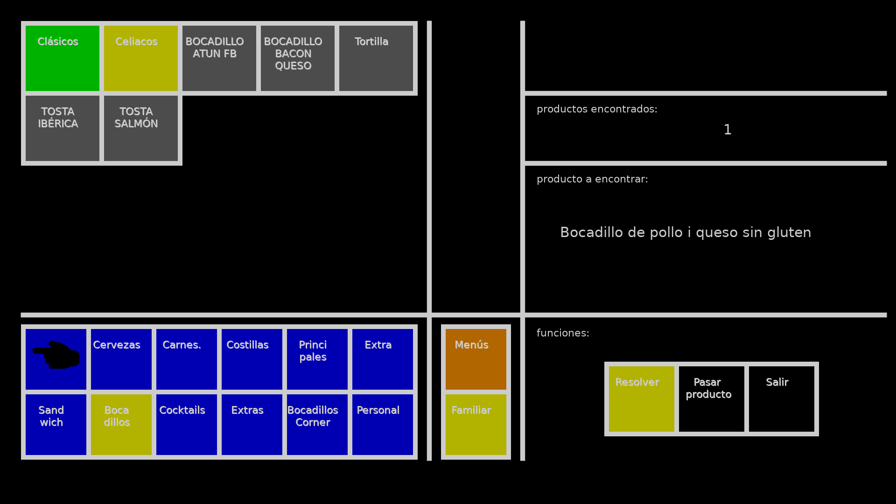

# TPV Learner

> A Lua/LÖVE2D training simulator I built while working as a waiter and learning to program, so new staff could practice finding products on the restaurant's POS without holding up service. An honest snapshot of where I was as a developer at the time.

<p align="center">
  <a href="YOUR_YOUTUBE_URL_HERE">
    
  </a>
</p>

<p align="center">
  
  
</p>

## About this repository

I worked as a waiter in a restaurant with high staff turnover. Every time someone new joined, they'd spend their first shifts asking colleagues, mid-service, where each product lived in the POS: which panel, which submenu, which button. There was no training material for this. You learned by interrupting whoever was busy.

I was learning Lua at the time, so I built this to fix it. To make the trainer actually useful, I had to catalogue the entire POS by hand: every product, every category, every nested menu, every cryptic button label, typed manually into Lua tables while cross-referencing the live terminal during quiet hours over several shifts. The result mirrors the real POS one-to-one, same panels, same nested menus, same button labels (typos, line breaks, and inconsistent naming included, because correcting them would have defeated the purpose, the trainee needs to find the *real* button, not an idealized version of it).

The practice loop is simple: it picks a random product, shows you its everyday name ("Cappuccino", "Hamburguesa premium halal", "Botella de Albariño Fefiñanes"), and you have to navigate the POS to find the button that sells it. There's a hint button that highlights the correct path, a skip button, and a counter that ends the session at 10 found.

The owner appreciated the work and rewarded me for it. The program ended up installed on the laptop the restaurant kept aside for staff to complete their mandatory workplace safety training, so new hires could practise the POS during the same downtime they used for the official course.

**One important consequence of how the data was built: this is not a reusable, generic POS trainer.** The menu hardcoded in `data.lua` is specific to one restaurant at one point in time. To adapt it to another establishment, you'd have to redo the cataloguing work from scratch and rewrite the entire data layer by hand. I list a fix for this in [What I'd do differently today](#what-id-do-differently-today), but as the repo stands, it's an artifact of a specific place, not a tool you can plug into your own restaurant.

The repo is uploaded essentially as-is. The code has rough edges, decisions I wouldn't make today, and patterns I'd factor out without thinking twice. It's here because this repository isn't trying to showcase "clean code", it's here to show two things:

- that I identified a real workflow problem in my day job and built something concrete that solved it while still learning the language,
- and that today I can look at the code with a critical eye and point to exactly what's wrong with it.

That second part is documented below, in [Technical debt and decisions I'd revisit](#technical-debt-and-decisions-id-revisit) and [What I'd do differently today](#what-id-do-differently-today).

## What's inside

### The data layer

`data.lua` is the heart of the project. It encodes the entire POS hierarchy as nested Lua tables, three top-level panels (`panel1`, `panel2`, `panel3`) plus a menus panel, each holding categories (`ensaladas`, `bebfrias`, `bebAlcohol`, `cervezas`, ...) and their subcategories. Button labels include the actual line breaks (`"Café\nLeche\nMedium"`) that appear on the real touchscreen, because that visual fragmentation is part of what makes the interface hard to learn in the first place.

Two reverse-lookup tables back the practice loop:

- **`botonesPorProducto`** maps each product's friendly name to the sequence of buttons a user must click to reach it (panel → category → subcategory → product).
- **`mapeoNombres`** maps the cryptic on-button label back to the everyday product name shown to the trainee.

### The practice loop

`practisemenu.lua` builds the play screen dynamically:

- **Two button grids.** The left side shows the panel buttons (categories like `Ensaladas`, `Beb Calient`), the right side shows the products inside the currently selected category. Clicking a category swaps the right grid.
- **Hint system.** Pressing `Resolver` highlights in yellow the entire chain of buttons leading to the correct answer, from the top-level panel down to the final product. It's a toggle.
- **Score and pacing.** A counter tracks correct answers. `Pasar producto` skips the current target without penalty. After 10 correct, the session ends and returns to the start menu.

### The state machine

`states.lua` and `startmenu.lua` form a minimal two-state system, `startmenu` (title + Start / Exit) and `practisemenu` (the game itself). Transitions happen by mutating `Data.currentState`, which the main loop reads each frame to pick which menu to draw and route input to.

## How to run it

You'll need **LÖVE 11.x** ([love2d.org](https://love2d.org)). The project is plain Lua, no extra dependencies.

Clone the repo, then from the project directory:

```sh
love .
```

On Windows you can also drag the project folder onto `love.exe`.

The window is laid out for **1920×1080** (see [Technical debt](#technical-debt-and-decisions-id-revisit) below, this is one of the things I'd fix).

## Controls

The whole UI is mouse-driven, no keyboard input.

| Action | How |
|---|---|
| Start a practice session | Click `EMPEZAR` in the start menu |
| Navigate categories | Click a panel button on the left grid |
| Submit an answer | Click the product button you think is correct |
| Toggle the hint | Click `Resolver` (highlights the path in yellow) |
| Skip the current product | Click `Pasar producto` |
| End the session early | Click `Salir` |

A session ends automatically after 10 correct answers.

## Project structure

```
tpv-learner/
├── main.lua             # LÖVE entry point, loads modules and routes events
├── conf.lua             # LÖVE window config
├── data.lua             # POS hierarchy + reverse-lookup tables
├── menus.lua            # Aggregates menu instances for the state machine
├── states.lua           # Two-state machine (startmenu, practisemenu)
├── startmenu.lua        # Title screen
├── practisemenu.lua     # The practice game itself
└── assets/              # Panel icons (image1, image2, image3)
```

## Technical debt and decisions I'd revisit

I've re-read this with hindsight. I'm listing the issues not to make excuses, but to make the point that **I can identify them now**, which is the actual skill that matters.

- **Massive duplication in the data layer.** `botonesPorProducto` (product → path) and `mapeoNombres` (label → name) are both filled by hand, one entry per product, ~150 entries each. The structure of the POS already encodes the path, both tables should be *derived* from `Data.listas` at startup, not maintained alongside it. Right now adding a single new product means editing three places.
- **The `buttonActions` table in `practisemenu.lua`** has ~90 nearly identical entries of the form `["X"] = { lista = lastParamUsed1, action = "x" }`. This is the click handler asking "what list should I show next?", but it could be generated programmatically from `Data.listas` keys.
- **`listaMapping` is essentially a manual copy of `Data.listas` keys.** With a few aliases handled programmatically (`panel22` → `panel2`, `bolleria1` → `bolleria`, `menupromocionado1` → `menupromocionado`) it could be replaced with `Data.listas` directly.
- **Accidental globals.** `lastParamUsed1` and `lastParamUsed2` are missing `local` declarations in `updateButtons`, so they live on `_G`. Same with `productosEncontrados`, `pista`, and `nombreMostrado`. Some of these are read across modules and there's no clear contract.
- **Coordinates hardcoded to 1920×1080.** Every `x`, `y`, `w`, `h` in the draw code is a pixel literal. Any other resolution and the layout breaks.
- **Magic strings as keys.** Buttons are matched by their visible text, including the `\n` line breaks. Renaming a label means hunting through every lookup table. A stable internal ID, decoupled from the display name, would have made the data layer rename-safe.
- **Typos preserved from the source POS.** `pepsiLigh` (missing `t`), `Sumple\nmentos`, `menupromoncionado`. These mirror real typos in the production system, which is honestly part of the project's authenticity (if the trainer "fixed" them, the trainee would learn the wrong button), but a clean rewrite would normalize the internal names and keep the typos only in the display layer.
- **No persistence.** Scores aren't saved between sessions, there's no leaderboard, no per-product accuracy tracking. The trainer can tell you you got 10/10 today but not which products you keep missing.

## What I'd do differently today

If I were rewriting this from scratch:

1. **Single source of truth in `data.lua`.** Define the POS hierarchy once, and derive `botonesPorProducto`, `mapeoNombres`, `listaMapping`, and `buttonActions` from it at startup. The whole lookup-table block in `practisemenu.lua` would disappear.
2. **Stable internal IDs for products and panels**, with display names as a separate concern. No more matching on `"Café\nLeche\nMedium"` as a key.
3. **A layout system based on `love.graphics.getDimensions()`** so the UI adapts to any resolution. Grids defined by row and column counts and proportional sizing, not pixel coordinates.
4. **Proper module scoping.** Every cross-module value passes through a function parameter or an explicit module export. No accidental globals.
5. **Persistence.** Save best score, time per session, and per-product hit/miss counts to a JSON file. Then weight the random selection toward the products the trainee gets wrong most often, so practice converges on the user's actual weak spots.
6. **A keyboard input mode.** Real POS terminals on the floor are touch-only, so mouse is the right default. But for solo practice on a laptop, typing the first letters of a product to filter the answer would speed things up enormously.
7. **Decouple the data from the restaurant.** Right now the menu is hardcoded for one specific establishment. A JSON or YAML file describing any restaurant's POS, loaded at startup, would make this reusable as a generic POS-training tool.

None of this is going to be applied to this repo. It is what it is, and that's the point of keeping it public.

## Stack

- **Language:** Lua 5.1 (bundled with LÖVE)
- **Framework:** [LÖVE 11.x](https://love2d.org), a 2D framework for Lua
- **Platform:** Cross-platform (Windows / macOS / Linux), developed and tested on Windows

## Third-party

None. All code is mine. The only runtime dependency is LÖVE2D itself, which is not bundled and must be installed separately from [love2d.org](https://love2d.org).

## License

MIT, see [LICENSE](LICENSE).

---

*If you made it this far: thanks for taking a look. If you find a bug, want to comment on the code, or just tell me how you'd have done it, open an issue. I'd genuinely love to hear about it.*